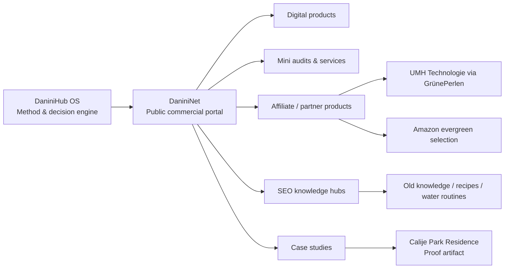
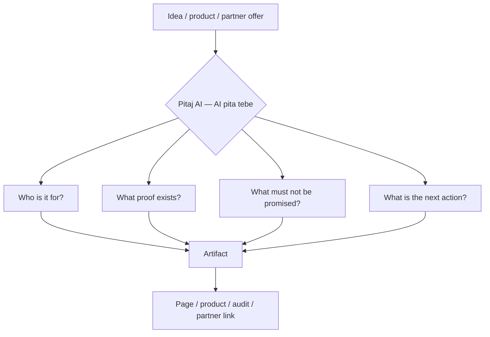
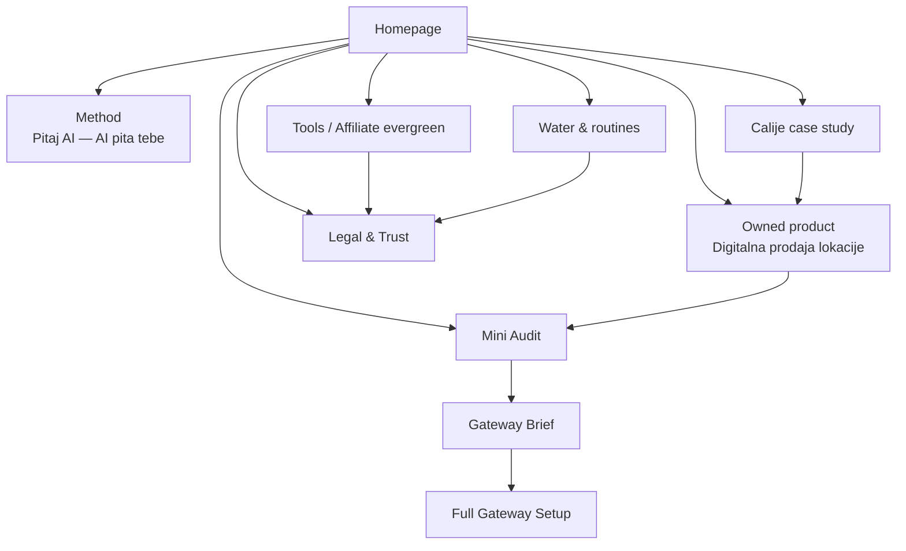
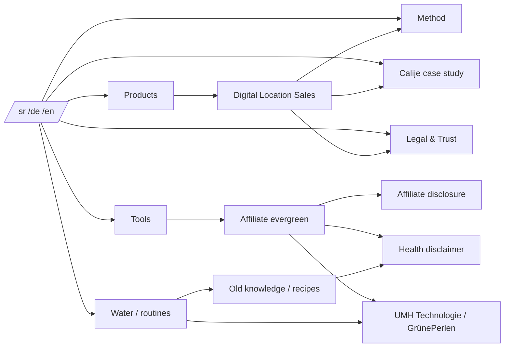

# DaniniNet Visual System Diagrams v01

## Purpose

This file defines visual assets, diagrams, tables and UI blocks for the next DaniniNet implementation pass. These visuals should help the site communicate monetization, SEO structure, internal linking, partner logic and the DaniniHub OS method without generic AI clichés.

## Visual style

- Premium dark base: charcoal / deep navy
- Ivory readable cards
- Muted gold or muted lime accent
- Swiss-minimal layout discipline
- Serious icons, no neon robots, no cyber clichés
- Use badges, flow arrows, cards, proof blocks and tables

## 1. Core system diagram

### UI interpretation

Use as a homepage graphic block:

- Left card: DaniniHub OS
- Center card: DaniniNet
- Right column: revenue paths
- Bottom proof card: Calije Park Residence
- Accent badges: Method, Product, Partner, Proof, SEO

## 2. Pitaj AI decision gate

### UI interpretation

Create as a repeated component:

- Small box title: `Pitaj AI — AI pita tebe`
- Four question chips:
  - Kome služi?
  - Koji dokaz postoji?
  - Šta ne obećavamo?
  - Koji je sledeći korak?

This block should appear on product, affiliate, health and case-study pages.

## 3. Monetization ladder

| Level | Offer | Price model | Role | Main CTA |
|---|---:|---:|---|---|
| 1 | Digitalna prodaja lokacije | 29 EUR launch / 49 EUR regular | First owned digital product | Buy guide |
| 2 | Mini Audit | 49 EUR | Low-friction service | Request audit |
| 3 | Gateway Brief | 149–299 EUR | Structured artifact | Order brief |
| 4 | Full Gateway Setup | 499–999 EUR | Implementation package | Start setup |
| 5 | Affiliate / Partner | Commission-based | Supporting revenue | View partner product |
| 6 | Directory Premium | 19–49 EUR/month | Recurring revenue | Join directory |
| 7 | Featured sponsor | 99 EUR/month or campaign | Category visibility | Become sponsor |

### UI interpretation

Use a vertical stepper or horizontal ladder. Make `Digitalna prodaja lokacije`, `Mini Audit`, and `UMH/GrünePerlen` visible early.

## 4. Homepage commercial flow

### UI interpretation

Homepage must not only explain the brand. It must show routes to money:

- Buy product
- Request mini audit
- View partner products
- Open case study
- Read trust/legal

## 5. SEO / internal linking map

### UI interpretation

Add internal link panels at bottom of each page:

- Related product
- Related method
- Related trust page
- Related case study
- Next action

## 6. Affiliate card structure

| Field | Example |
|---|---|
| Product | UMH Technologie via GrünePerlen |
| Category | Water / Routine / Health |
| Region | DACH-ready |
| Badge | Partner product, Affiliate link, Health disclaimer |
| For whom | Users interested in water routine and responsible purchase decisions |
| Not for | Users expecting medical treatment claims |
| Question | Da li ti treba bolja dnevna rutina, manje plastike, ukus vode ili tvrdnja koju moraš posebno proveriti? |
| Disclosure link | Affiliate disclosure + Health disclaimer |

## 7. Badge system

Recommended badge groups:

### Trust
- Human review
- No guarantee
- Health disclaimer
- Affiliate disclosure
- AI transparency

### Region
- DACH-ready
- Balkan-ready
- Global

### Commercial
- Digital product
- Partner product
- Affiliate link
- Mini audit
- Evergreen

### Method
- Pitaj AI Gate
- Proof before claim
- Artifact before campaign
- Question before recommendation

## 8. Icon system

| Pillar | Icon direction | Avoid |
|---|---|---|
| Income | chart, transaction, market path | money rain, hype arrows |
| Intelligence | question, dialogue, decision gate | robot face, neon brain |
| Health | water drop, kitchen, routine | medical cross claims |
| Artifact | document layers, proof card | generic file icon only |
| Partner | network, handshake, link | random chain link spam |
| Trust | shield, check, disclosure card | fake award badges |

## 9. Suggested homepage visual blocks

### Block A — System map
A dark hero-adjacent diagram showing DaniniHub OS → DaniniNet → revenue paths.

### Block B — Monetization ladder
A premium ivory section with the seven revenue levels.

### Block C — Decision gate
A reusable dark card with four question chips.

### Block D — Affiliate partner card
A trust-first partner card for UMH Technologie via GrünePerlen.

### Block E — Internal linking panel
At bottom of pages, show next steps with descriptive links.

## 10. Implementation rules

- Use semantic HTML where possible.
- Do not hide important links inside only visual graphics.
- Diagrams must have text equivalents for SEO and accessibility.
- If using SVG diagrams, keep labels as text where possible.
- Every visual block must support SR/DE/EN localization.
- No private Calije assets.
- No invented affiliate claims.
- No medical claims.
